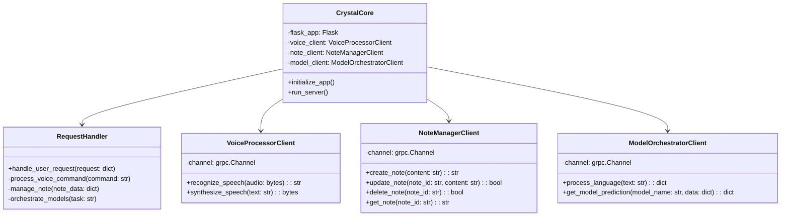

# CrystalCore

## Class Diagram

## Class Descriptions

### CrystalCore
The main class that initializes and runs the Flask application. It coordinates all other components of the system.

- **Attributes**:
  - `flask_app`: The Flask application instance
  - `voice_client`: Client for communicating with the VoiceProcessor
  - `note_client`: Client for communicating with the NoteManager
  - `model_client`: Client for communicating with the ModelOrchestrator

- **Methods**:
  - `initialize_app()`: Sets up the Flask app and initializes all clients
  - `run_server()`: Starts the Flask server

### RequestHandler
Handles incoming user requests and delegates tasks to appropriate clients.

- **Methods**:
  - `handle_user_request(request: dict)`: Main method to process incoming requests
  - `process_voice_command(command: str)`: Handles voice-related commands
  - `manage_note(note_data: dict)`: Manages note-related operations
  - `orchestrate_models(task: str)`: Coordinates AI model tasks

### VoiceProcessorClient
Client for communicating with the VoiceProcessor service.

- **Attributes**:
  - `channel`: gRPC channel for communication

- **Methods**:
  - `recognize_speech(audio: bytes) -> str`: Sends audio for speech recognition
  - `synthesize_speech(text: str) -> bytes`: Requests speech synthesis for given text

### NoteManagerClient
Client for communicating with the NoteManager service.

- **Attributes**:
  - `channel`: gRPC channel for communication

- **Methods**:
  - `create_note(content: str) -> str`: Creates a new note
  - `update_note(note_id: str, content: str) -> bool`: Updates an existing note
  - `delete_note(note_id: str) -> bool`: Deletes a note
  - `get_note(note_id: str) -> str`: Retrieves a note

### ModelOrchestratorClient
Client for communicating with the ModelOrchestrator service.

- **Attributes**:
  - `channel`: gRPC channel for communication

- **Methods**:
  - `process_language(text: str) -> dict`: Sends text for language processing
  - `get_model_prediction(model_name: str, data: dict) -> dict`: Requests prediction from a specific model

## Relationships
- CrystalCore is the main class that uses RequestHandler to process requests.
- CrystalCore also uses VoiceProcessorClient, NoteManagerClient, and ModelOrchestratorClient to communicate with other services.
- Each client class (VoiceProcessorClient, NoteManagerClient, ModelOrchestratorClient) is responsible for communication with its respective service using gRPC.